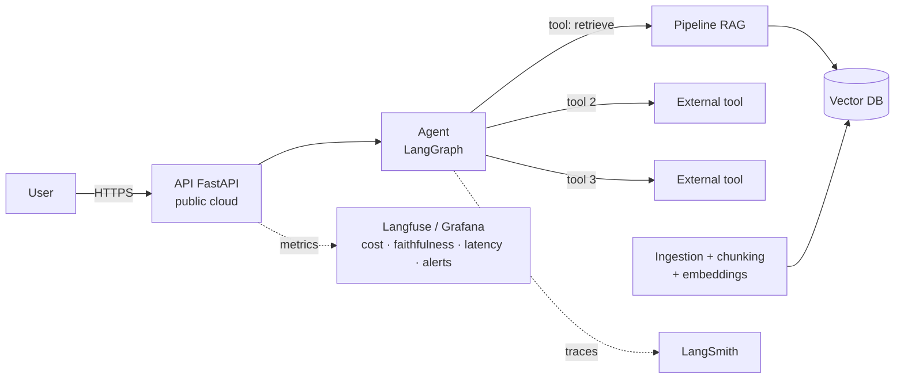

# Module VI — Final Project / Capstone (2 ECTS)

The capstone integrates the entire program into a single production-grade system: a **demonstrable-quality RAG pipeline** (RAGAS ≥ 0.75) orchestrated by a **autonomous agent with at least 3 tools**, **deployed on the cloud** with a public URL, **monitored with LLMOps** (cost, quality, latency, alerts), and featuring a **real and projected cost analysis**. This is not a notebook: it is a service that another person can open in a browser, use, and break.

The bar is deliberately set at the level of an LLM Engineer technical interview: if, upon completion, you cannot show the URL, the traces, the dashboard, and defend every architectural decision during 15 minutes of hostile questioning, the capstone is not finished.

## Module Map

| File | What it solves |
|---|---|
| [`01-propuestas-de-proyecto.md`](01-propuestas-de-proyecto.md) | 5 ready-to-choose projects + guide for proposing your own |
| [`02-documento-de-arquitectura/`](02-documento-de-arquitectura/) | Architecture document template and ADR format with example |
| [`03-guia-rag.md`](03-guia-rag.md) | RAG pipeline checklist and how to demonstrate RAGAS ≥ 0.75 |
| [`04-guia-agente.md`](04-guia-agente.md) | Tool design, LangSmith traces, errors, and guardrails |
| [`05-guia-despliegue.md`](05-guia-despliegue.md) | Platform comparison, uptime ≥ 99% and P95 < 3 s measured |
| [`06-guia-llmops.md`](06-guia-llmops.md) | Dashboard: cost/query, faithfulness, latency, and alerts |
| [`07-analisis-de-costes.md`](07-analisis-de-costes.md) | Cost breakdown template and projection for 10x/100x |
| [`08-defensa-y-demo.md`](08-defensa-y-demo.md) | 20-minute demo script and 25+ jury questions |
| [`checklist-final.md`](checklist-final.md) | Each official deliverable mapped to its concrete evidence |

## Official Deliverables

1. **Architecture Document** — technical diagram, ADRs, and stack justification ([templates](02-documento-de-arquitectura/))
2. **Complete RAG Pipeline** — ingestion, indexing, retrieval, with RAGAS evaluation ≥ 0.75 ([guide](03-guia-rag.md))
3. **Autonomous Agent** — ≥ 3 integrated tools, documented LangSmith traces ([guide](04-guia-agente.md))
4. **Cloud Deployment** — public URL, uptime ≥ 99%, P95 latency < 3 s ([guide](05-guia-despliegue.md))
5. **LLMOps Dashboard** — cost/query, faithfulness, latency, and configured alerts ([guide](06-guia-llmops.md))
6. **Cost Analysis** — actual breakdown of inference and scaling projections ([template](07-analisis-de-costes.md))
7. **AWS AIF-C01 Mock Exam** — 65 questions with review of areas for improvement → material at [`../certificaciones/aws-aif-c01/`](../certificaciones/aws-aif-c01/)
8. **NCA-GENL Preparation** — five weighted areas, ten topics, flashcards, and a 50-question mock exam → material at [`../certificaciones/nvidia-nca-genl/`](../certificaciones/nvidia-nca-genl/)
9. **Live Demo (20 min) + code review + technical defense (15 min Q&A)** ([guide](08-defensa-y-demo.md))

## Reference Architecture

Your specific system will vary, but all valid projects fit this general form:

## Evaluation Rubric

The final grade is composed as follows. Each criterion is scored from 0 to 10 and weighted. **Minimum passing grade: 7.0**, and there are also three elimination *gates* that, if not met, result in failing the capstone regardless of the rest: RAGAS faithfulness ≥ 0.75 on the evaluation dataset, a working public URL on the day of the demo, and the agent's 3 tools running with verifiable traces.

| Criteria | Weight | 10 means | 5 means |
|---|---:|---|---|
| Architecture and ADRs | 15% | Precise diagrams, ≥ 5 ADRs with real discarded alternatives and quantified trade-offs | Generic diagram, ADRs that only justify what had already been decided |
| RAG Quality | 20% | RAGAS ≥ 0.75 on a dataset of ≥ 50 questions, failure analysis by category, ablation of at least one decision (chunking or reranker) | Metric achieved but without analysis: doesn't know *why* it works |
| Agent and Tools | 15% | 3+ non-trivial tools, tool-specific error handling, guardrails demonstrated with traces of adversarial cases | Tools that only work in the happy path |
| Deployment and Reliability | 15% | Public URL, uptime ≥ 99% with evidence of ≥ 2 weeks, P95 < 3 s measured with real load, CI/CD | Deployed but without reliability metrics or with measurements from a single session |
| LLMOps Observability | 10% | Dashboard with the 4 signals, alerts that have triggered at least once (provoked or real) and a postmortem | Dashboard set up but decorative: no one would look there to diagnose |
| Cost Analysis | 10% | Real cost/query measured, breakdown by component, 10x/100x projection with concrete levers and their estimated savings | Calculator estimate not cross-referenced with the actual bill |
| Code Quality | 5% | Tests, typing, project structure, secrets outside the repo, reproducible README | Works but is not reproducible by a third party in < 30 min |
| Demo and Defense | 10% | Fluid demo including a controlled failure, answers that cite data specific to the project | Correct demo but generic manual-style answers |

## Suggested Calendar: 6 weeks

Corresponds to weeks 25–30 of the [curriculum](../PLAN_DE_ESTUDIOS.md). The golden rule: **deploy in week 2, not in week 6**. Everything you measure (uptime, P95, real cost) requires weeks of data, and you only accumulate that data if the system goes live early.

| Week | Closing Milestone (verifiable) | Main Work |
|---|---|---|
| 1 | Chosen proposal + v1 architecture document with ≥ 3 ADRs. Corpus downloaded and explored. | Choose project, define scope, diagrams, decide stack. Set up repo, CI, and FastAPI skeleton. |
| 2 | **System deployed in the cloud with a public URL** (even if it's a minimal RAG without an agent). v1 Evaluation Dataset (≥ 30 questions). | Ingestion + indexing + basic retrieval. Deploy with healthcheck and uptime monitor activated from the start. |
| 3 | RAGAS ≥ 0.70 on the v1 dataset. First agent tool working with traces in LangSmith. | Iterate on chunking/retrieval/reranking guided by RAGAS. Agent skeleton in LangGraph. |
| 4 | Complete agent with 3 tools, guardrails, and error handling. RAGAS ≥ 0.75 on the final dataset (≥ 50 questions). | Tools 2 and 3, adversarial cases, expand evaluation dataset. Mock AIF-C01 ([deliverable 7](../certificaciones/aws-aif-c01/)). |
| 5 | Complete LLMOps Dashboard with tested alerts. Load test executed: P95 < 3 s documented. v1 Cost Analysis. | Langfuse/Grafana, alerts, k6/locust, measure real cost per query. Flashcards and mock NCA-GENL ([deliverable 8](../certificaciones/nvidia-nca-genl/)). |
| 6 | All deliverables closed according to [`checklist-final.md`](checklist-final.md). Demo rehearsed ≥ 2 times with a stopwatch. | Freeze features. Final architecture document, final cost analysis, demo and defense rehearsal, review of weak areas from the mocks. |

## Rules of the Game

- **Closed scope in week 1.** Changing projects after week 2 almost guarantees failure to finish. If the corpus turns out to be bad, change the corpus, not the project.
- **Set the API budget before starting.** Capture the current official rate in the ADR,
  the total limit for the 6 weeks, and the split between development, evaluation, and demo. Use the most
  efficient tier that exceeds your evals and scale only the tasks whose quality justifies it. Exceeding
  the limit without having detected it in your dashboard is, in itself, an LLMOps failure.
- **Every claim needs evidence.** "Has 99% uptime" without a screenshot from the external monitor is just a phrase, not a deliverable. The [`checklist-final.md`](checklist-final.md) defines the exact evidence for each one.
- **The code is yours.** You can use AI assistants to write it (it's the industry's real practice), but during the defense you will be asked line by line: anything you cannot explain counts as not done.
