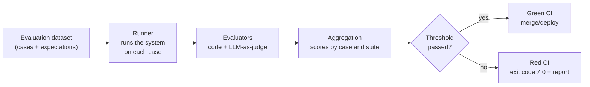

# Continuous evaluation: eval pipelines and regression testing in CI

> **Associated lab:** [`05_eval_regresion.py`](../labs/05_eval_regresion.py)

## The problem: everything changes beneath you

In classic software, if you don't touch the code, the behavior doesn't change. In LLM systems, there are four sources of change and you only control two:

| Source of change | Do you control it? | Example |
|---|---|---|
| Your prompt | Yes | You add a rule to the system prompt and accidentally break another |
| Your pipeline (retrieval, tools, parameters) | Yes | You change `top_k` from 8 to 4 to save tokens |
| The provider's model | No | The provider retires the fixed snapshot and forces migration |
| World data | No | Users start asking questions that your RAG doesn't cover |

The answer to this is the same one software gave to regression bugs: **automatic tests that run on every change**. The difference is that here the tests are not deterministic and "passing" is not boolean but a score with a threshold.

## Anatomy of an evaluation pipeline



### 1. The evaluation dataset

It is the most valuable asset in the pipeline and the one that is least well cared for. Sources, in order of value:

1. **Real production failures** (from your traces — which is why observability comes first).
   Each reported bug becomes an eval case before being fixed, exactly like
   a classic regression test.
2. **Cases written by hand by domain experts**: the "golden set". 30–50 well-chosen cases are worth more than 5,000 synthetic ones.
3. **Synthetic cases generated by LLMs**: useful for volume and edge coverage
   (typos, languages, hostile inputs), but validate them: they inherit the generator's biases.

Minimum structure of a case (the one used in lab 05):

```json
{
  "id": "refund-policy-01",
  "input": "¿Puedo devolver un producto después de 45 días?",
  "expectations": {
    "must_contain": ["30 días"],
    "must_not_contain": ["sí, sin problema"],
    "judge_criteria": "Debe decir que el plazo es 30 días y ofrecer la excepción de producto defectuoso"
  }
}
```

### 2. Evaluators: code first, judge second

There are two families, and the typical mistake is jumping to the second without fully exploiting the first:

**Code-based evaluators (deterministic, free, fast):**

- Format: Is it valid JSON? Does it comply with the Pydantic schema? Is the length within range?
- Literal content: contains/does not contain key strings or regex.
- Classic metrics when there is a reference: exact match, F1 on extracted entities.
- Behavior: Did it call the correct tool? Did it cite any source from the context?

**LLM-as-judge (flexible, costs money, has biases):**

- A model evaluates the output against a rubric ("is the answer faithful to the context?").
- Essential for semantic quality, but remember its known biases: it prefers
  long answers (verbosity bias), prefers the first option you show it
   (position bias), and grades itself well (self-preference). Mitigations: rubrics
  with binary criteria instead of 1–10 scales, randomize order in A/B comparisons,
  and use a different (or more powerful) model than the one being evaluated.
- **Calibrate the judge against humans**: manually label 50 cases, measure agreement
   (Cohen's kappa), and only trust the judge where agreement is high.

Practical rule: each case should have at least one code-based evaluator. The judge adds
signal, it does not replace it. In RAG you already know this idea from RAGAS (Module III: faithfulness,
answer relevance); here we generalize it to any system.

### 3. Thresholds and gates: how to decide red/green

- **Absolute threshold**: "mean score ≥ 0.85 and no critical case failed". Simple, but
  becomes obsolete if the dataset grows.
- **Comparison against baseline** (the true *regression testing*): run the suite
  with the current version and the candidate, and fail if the candidate worsens by more than X points
  or breaks cases that used to pass. Protects against regression even if the absolute score
  is high.
- **Marked critical cases**: a subset `critical: true` where any failure
  blocks, without averaging. These are the ones for safety and compliance (e.g., "never
  promise refunds outside the deadline", "never give medical advice").

Regarding non-determinism: run with `temperature=0` and `seed` fixed where the provider
supports it, and even then assume variance. For small suites, running each case 3 times and
averaging reduces false reds; for fast CI, one pass with loose thresholds and one
nightly suite with stricter requirements.

## CI Integration

The contract with CI is primitive by design: **a process that prints a report and exits
with code 0 or 1**. This makes it tool-agnostic (GitHub Actions, GitLab,
Jenkins). Lab 05 implements exactly this contract.

```yaml
# .github/workflows/eval.yml (esqueleto)
name: prompt-regression
on:
  pull_request:
    paths: ["prompts/**", "app/llm/**", "evals/**"]
jobs:
  eval:
    runs-on: ubuntu-latest
    steps:
      - uses: actions/checkout@v7
      - uses: astral-sh/setup-uv@v10
      - run: uv sync --extra ops
      - run: uv run python modulo-08-production-engineering/labs/05_eval_regresion.py
        env:
          OPENAI_API_KEY: ${{ secrets.OPENAI_API_KEY }}
```

Design decisions that matter in practice:

- **Trigger only when prompts/pipeline change** (`paths:`): running real-API
evals on every README commit burns money and patience.
- **Budget the suite**: # of cases × avg tokens × price. A suite of 100 cases
with `gpt-5.6-luna` costs much less than with a flagship tier. Cheap suite in PR,
costly suite nightly.
- **Cache responses by hash of (prompt, input, model, params)**: if the PR doesn't touch a
case, don't re-run it.
- **Save the report as an artifact** (JSON/HTML) to inspect failures without
re-executing.

### Maturity Levels

| Level | What's there | Signal that you're here |
|---|---|---|
| 0 | "Vibes": manual tests in the playground | "It works for me" in the PR |
| 1 | Golden set + local script | Runs "when we remember" |
| 2 | Suite in CI with exit code, gate on PRs | Prompt changes go through PRs and can fail |
| 3 | Comparative baseline + online evals on sampled traffic | You detect regressions the dataset didn't cover |
| 4 | Closed loop: production failures feed the dataset automatically | The dataset grows on its own and the team trusts the green |

The realistic goal of this module is to leave you at level 2–3.

## Ecosystem Tools

| Tool | What it offers | Trade-off |
|---|---|---|
| **pytest a pelo** (lab 05 is the framework-free version) | Zero dependencies, total control, native exit code | All manual: reports, parallelism, cache |
| **LangSmith evals** | Versioned datasets on the platform, integrated judge, comparison UI between runs | SaaS, lock-in, cost |
| **Langfuse datasets + evals** | The same, self-hostable | Less mature in run comparison |
| **promptfoo** | Declarative CLI (YAML), prompt × model matrix, good HTML report | Oriented towards standalone prompts; cumbersome for evaluating complex pipelines |
| **DeepEval / Ragas** | Ready-made metrics (faithfulness, toxicity...), pytest integration | Opinionated metrics; check what's underneath before trusting the number |
| **Inspect (UK AISI)** | Rigorous eval framework, good for serious model evaluations | Steeper learning curve; designed more for evaluating models than features |

Tip: start with the pattern from lab 05 (JSON dataset + custom runner + exit code).
When the dataset grows beyond ~100 cases or you need to compare historical runs, migrate to
LangSmith or Langfuse **keeping your dataset in your repo**: the dataset is yours, the
platform is replaceable.

## Common Errors

1. **Evaluating only the happy path.** Half of the suite should be adversaries: ambiguous
   inputs, out-of-domain, hostile, in other languages.
2. **Using LLM-as-judge without calibrating it.** An uncalibrated judge is a random number with
   good looks.
3. **Static dataset.** If no real production failures have entered the
   dataset in 3 months, the pipeline evaluates the system from 3 months ago.
4. **Optimizing against the suite** (prompt overfitting). Just like with tests: if you iterate
   the prompt by looking at the cases, you need a held-out set that you don't look at.
5. **Blocking CI with slow and expensive evals on every commit.** The team will end up
   skipping the gate. Cheap in PR, expensive in nightly.
6. **Treating the score as absolute truth.** 0.87 vs 0.85 with 40 cases is not a signal, it's
   noise. Look at the intervals and, above all, look at the specific failures.

## For Further Reading

- Hamel Husain, "Your AI Product Needs Evals": <https://hamel.dev/blog/posts/evals/>
- LangSmith — evaluation concepts: <https://docs.langchain.com/langsmith/evaluation>
- promptfoo — CI guide: <https://www.promptfoo.dev/docs/integrations/ci-cd/>
- Ragas (Module III review, applied to CI): <https://docs.ragas.io/>
- Inspect, UK AI Safety Institute: <https://inspect.aisi.org.uk/>
- Zheng et al., "Judging LLM-as-a-Judge with MT-Bench and Chatbot Arena" (judge biases): <https://arxiv.org/abs/2306.05685>
