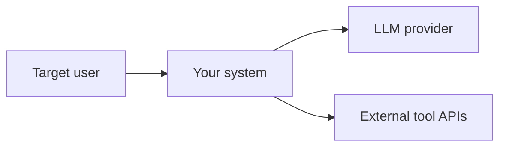
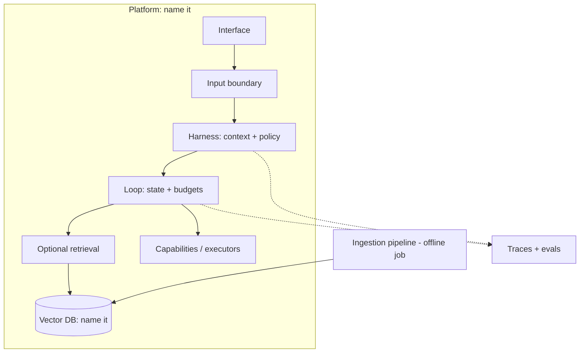
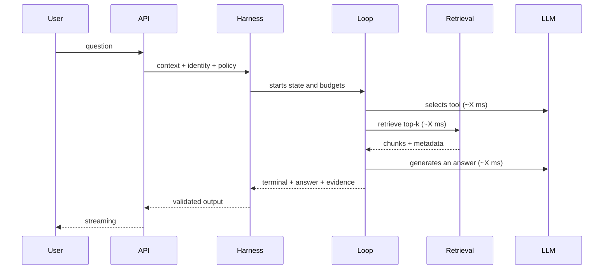

# Architecture Document — [Project Name]

> **How to use this template.** Replace each instruction block with your content and delete it.
> Evidence, not a page count, determines length. An architecture document records decisions and
> trade-offs; every costly or hard-to-reverse decision belongs in an ADR
> ([format here](plantilla-adr.md)).

**Version:** v1.0 · **Date:** YYYY-MM-DD · **Author:** [name] · **Status:** draft / in review / approved

---

## 1. Context and Problem

> Identify the user, JTBD, current cost, and outcome. End with a negative scope statement: what the
> system **does not** do and which risk that boundary avoids.

## 2. Requirements

### 2.1 Functional

> Numbered list (RF-1, RF-2…) of user-observable capabilities. Each in a verifiable sentence. Example of the expected style: "RF-3: when a question's answer is not in the corpus, the system explicitly states so and does not invent" — note that it is testable.

### 2.2 Non-functional (with number, not with adjective)

| ID | Requirement | Target | How it is measured |
|---|---|---|---|
| RNF-1 | Outcome latency | [precommitted target] | Load test from the real interface |
| RNF-2 | Availability | [SLO + window] | External monitor |
| RNF-3 | Claim support | [gate by segment/risk] | Eval harness + human audit |
| RNF-4 | Cost per outcome | < [your target] € | Usage receipts with versioned rates |
| RNF-5 | Authority | No effect outside the capability manifest | Adversarial suite + traces |

> Add your own. A non-functional requirement without a "how it is measured" column is not a requirement; it is an intention.

## 3. Architecture View

### 3.1 Context Diagram (C4 Level 1)

> Who interacts with the system and which external systems it interacts with. Mermaid or exported image.

### 3.2 Container Diagram (C4 Level 2)

> The central diagram of the document. Every box must exist: no aspirational components. Draw trust
> boundaries, the harness, loop, and capabilities; add retrieval or graphs only when they belong to
> the real system.

### 3.3 Request Flow

> Sequence diagram of the typical query, with real latencies measured per segment once you have the system (v1: estimated; final version: measured). This is the diagram you will use to justify where each latency optimization applies.

## 4. Technology Stack and Justification

> Table of chosen components. The key column is the last one: the alternative that lost. If you cannot name a serious alternative for any row, either you did not research it, or the decision was trivial and does not warrant a row.

| Layer | Choice | Why (1 line) | Discarded Alternative → ADR |
|---|---|---|---|
| LLM Generation | | | `adr/ADR-001.md` |
| Embeddings | | | |
| Vector DB | | | |
| Agent Orchestration | | | |
| API / Backend | | | |
| Cloud Platform | | | |
| Observability | | | |

## 5. Architecture Decisions (ADR Index)

> Minimum 5 ADRs for the field project. Candidates that almost always warrant one: vector DB choice, chunking strategy, LLM model(s) and cheap/expensive routing policy, agent architecture (why graph and not chain), deployment platform, and what you do when retrieval finds nothing.

| ID | Title | Status |
|---|---|---|
| `ADR-001` | | accepted |
| `ADR-002` | | accepted |
| ADR-NNN | Decision pending registration | Owner and target date |

## 6. Data

> Corpus origin, license/legal status, volume (documents, chunks, total tokens), ingestion pipeline (steps, idempotency, how re-indexing works), and metadata schema for each chunk. Include what PII the corpus contains and what you do about it (even if the answer is "none, because X").

## 7. Security

> The five minimums, with one sentence each about your concrete implementation: (1) secret management, (2) prompt injection — what enters the prompt from the user and the corpus and what you mitigate, (3) sandboxing/permissions for each agent tool, (4) rate limiting and API public auth, (5) what you log in traces and whether it contains user data.

## 8. Scalability and Known Limits

> Be honest: where the system breaks first as it grows (the vector DB? the LLM provider's rate limit? the cost?). Connect to the [cost projection](../07-analisis-de-costes.md). A solid "known limits" section earns more points in the defense than pretending it scales infinitely.

## 9. Document Change Log

| Version | Date | Change |
|---|---|---|
| v1.0 | | Initial hypotheses before optimization |
| v2.0 | | Review with the system already measured |

> Preserve at least two snapshots: one with the initial estimates and another with measured numbers
> and any ADRs that changed state. The diff is evidence of learning: what you believed, what you
> observed, and which decision changed.
