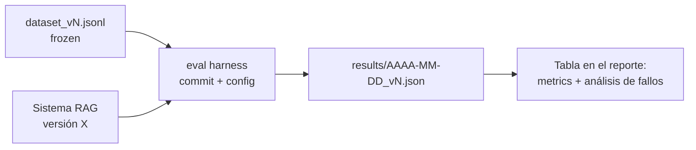

# Field project RAG Pipeline Guide

The evidence gate requires proof of what the system retrieves, which claims remain supported, and
when it abstains. It imposes neither RAGAS nor a universal threshold: it requires the dataset,
segments, judges, baselines, and targets to be declared **before** measurement. The theory lives in
[Module 3](../modulo-03-rag/); here you build a reproducible end-to-end proof.

## 1. Technical Pipeline Checklist

### Ingestion (separate job from serving)

- [ ] Ingestion is an **independent script/job** separate from the API (it runs offline; the API only reads the index). Mixing the two is the number one anti-pattern.
- [ ] **Idempotent and re-executable**: running it twice does not duplicate chunks (use deterministic IDs, e.g., hash of `doc_id + posición`).
- [ ] Extraction adapted to the actual format of the corpus (PDFs with tables ≠ Markdown ≠ HTML). You have inspected **manually** the output of at least 10 documents, including the ugly ones (tables, lists, headers/footers).
- [ ] Ingestion log: how many documents entered, how many failed and why (a corpus where "8% of PDFs failed" without your knowledge contaminates everything else).

### Chunking

- [ ] The chunking strategy is a **decision documented in an ADR**, not the framework's default. You know the average size and distribution of your chunks in tokens.
- [ ] Each chunk carries **metadata**: source document, section/title, position, and the filtering fields for your domain (version, category…).
- [ ] Elements that do not survive blind chunking (tables, code blocks, requirement lists) receive specific treatment (intact chunk, serialization to text, or summary + original).

### Retrieval

- [ ] top-k and threshold chosen with data (see §3), not by default.
- [ ] Compare lexical, semantic, and hybrid search when the corpus justifies it. Add a reranker or
  graph only when an ablation proves which segment improves and at what cost.
- [ ] Metadata filtering working when the query allows it.
- [ ] **"No answer" case**: when retrieval returns chunks below the relevance threshold, the system states this instead of generating on noise. This is what best protects your faithfulness.

### Generation

- [ ] The generation prompt requires **citing sources** (chunk/document ID) and the API returns them structured, not embedded in prose.
- [ ] Explicit and tested instruction not to respond outside the retrieved context.
- [ ] Streaming response to the client (affects latency perception and the P95 you report: define whether you measure time-to-first-token or total time, and state it).

## 2. The Evaluation Dataset

This is the piece that separates a serious field project from a demo. Requirements:

- Start with enough coverage for every segment to contain several cases; **50–80 questions** is a
  manageable reference, not a requirement. Expand the dataset when the interval or failure analysis
  cannot support a conclusion.

| Type | Approx. % | What it measures |
|---|---:|---|
| Simple factual (answer in 1 chunk) | 40% | Retrieval baseline |
| Multi-chunk (combine 2+ fragments or documents) | 25% | System's real merit |
| With implicit filter (version, category, date) | 15% | Metadata and filtered retrieval |
| **No answer in the corpus** | 10% | Abstention (the classic trap) |
| Ambiguous or poorly phrased, like real people ask | 10% | Robustness |

- Each entry has: `pregunta`, `respuesta_de_referencia` (written or verified by you against the corpus, with the source annotated), and `chunks_relevantes` (IDs) to be able to calculate context recall/precision.
- **You can generate question drafts with an LLM, but each one passes your human review**: unreviewed synthetic questions tend to be easy-for-retrieval (share exact vocabulary with the chunk) and inflate metrics. Rephrase at least half with vocabulary distinct from the source text.
- The dataset is **frozen by version** (`eval/dataset_v1.jsonl`, `v2`…): if you touch it after measuring, comparison between iterations dies. Adding questions ⇒ new version.
- **Do not iterate against the complete dataset.** Separate development and holdout; disclose any
  holdout use and create a new version when it stops being a blind test.

## 3. Evaluation protocol

Choose signals that separate retrieval, generation, and the abstention decision. RAGAS, DeepEval, or
a custom harness may execute part of the protocol; the library name is not the evidence.

| Signal | What it measures | Criterion |
|---|---|---|
| Recall/MRR/nDCG | Whether expected evidence appears and is well ranked | Precommitted target by segment |
| Claim support | Whether each material claim is backed by evidence | Risk-based gate |
| Answer utility | Whether it resolves the task rather than merely sounding fluent | Human or deterministic baseline |
| Abstention | Whether it rejects unanswerable questions without rejecting valid ones | False-positive/negative matrix |

Protocol:

1. **Fix the judge**: exact model, snapshot, prompt/rubric, and configuration. Audit a sample against
   human reviewers and measure disagreement; temperature zero does not remove all variance.
2. Run evaluation **with a versioned script** that writes case-level JSON/CSV including dataset,
   commit, corpus, models, top-k, and chunker. Without this the claim is not reproducible.
3. Repeat non-deterministic signals and report a distribution or interval, not only a mean. A gate
   that flips across runs needs more cases or an explicit decision rule.
4. Record the harness's own cost and latency. Use cheaper evaluators for frequent feedback and reserve
   the confirmation judge for releases, while checking correlation between them.

## 4. Review evidence

Your evaluation report (in the project README or in `eval/REPORTE.md`) must contain:

1. **Results table** by metric (mean ± range of repetitions), separating dev and holdout, with the exact configuration of the measured system.
2. **Iteration series**: table showing how metrics evolved with each relevant change (baseline →
   +hybrid → +reranker → prompt v3…). Prove which decision moved each segment.
3. **At least one ablation**: the same measurement with and without a costly decision (reranker,
   graph, or special chunking). Express improvement by segment alongside latency and cost; do not turn
   one average into a grade.
4. **Failure analysis**: the 5–10 worst-scored questions, classified by cause (retrieval failure / generation failure / questionable reference / unanswered question incorrectly abstained) and what you would do with each class. A 0.78 with failure analysis is worth more than a 0.85 without it.
5. **Declared limitations**: judge used and its bias, dataset size, what is not covered.

## 5. Failures that block the gate

- Measuring once at the end and treating the result as stable truth.
- Dataset generated 100% by LLM without review, with questions that literally repeat phrases from the corpus.
- Changing dataset and system simultaneously between measurements (you don't know what moved the metric).
- Reporting only one judge metric: without a retrieval signal you cannot locate the failure.
- Not versioning the configuration: you will be asked "with what top-k did that 0.79 come out?" and "I don't remember" invalidates the number.
