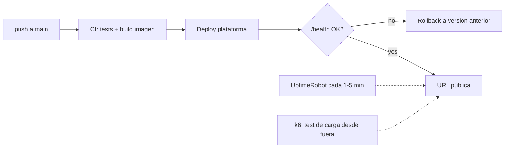

# Cloud Deployment Guide

The production gate requires **an accessible endpoint, an availability SLO, and a latency target**,
all three backed by measured rather than claimed evidence. This guide compares platforms, defines
how to measure each signal, and sets the minimum production checklist. A 99% target and P95 < 3 s
are useful baselines, not universal numbers: the JTBD may justify different targets before data is
collected.

One decision conditions everything: **deploy the first vertical slice as soon as it is operable**.
Availability needs an observation window; a deployment at the end produces a screenshot, not an
operational history.

## 1. Platform Comparison

Field project profile: Containerized API (FastAPI + agent), managed vector DB separately, and low traffic. Pricing, free tiers, regions, and suspension policies change frequently: check the official pages on the day you decide and save the URL, date, currency, and taxes in the ADR. The table compares architectural properties; the cost column is filled in with the current quote.

| Platform | Verified Monthly Cost | Pros | Cons | Fits if… |
|---|---|---|---|---|
| **Railway** | _Fill from official pricing_ | Deploy from repo in minutes, integrated logs and environment variables | Check RAM, available regions, egress, and suspension policy of the chosen plan | You prioritize delivery speed and the region meets your measured P95. |
| **Fly.io** | _Fill from official pricing_ | Regional selection and fine control of Machines | More operational decisions; auto-stop/cold start affects latency | You need a nearby region and want to control lifecycle and scaling. |
| **Render** | _Fill from official pricing_ | Managed flow, integrated TLS and domains | Verify if the chosen plan suspends the service and measure its cold start | You already know the platform and the plan sustains the SLO without sleeping. |
| **AWS App Runner / ECS Fargate** | _Calculate compute, network, logs, and registry_ | Native IAM, ECR, and CloudWatch; good cloud traceability | Larger configuration surface and cost split across services | You want to demonstrate AWS architecture and have budgeted for its operation. |
| **AWS Lambda + API Gateway** | _Calculate requests, duration, network, and concurrency_ | Scales to zero and charges by usage | Cold starts with heavy dependencies; streaming and multi-step agent require validating limits | The traffic profile is sporadic and your tests meet P95 and duration. |
| **VPS + Docker** | _Sum instance, backups, network, and operational time_ | Host control and predictable cost | You operate TLS, firewall, patches, backups, and rollback | You can demonstrate hardening and reproducible operation. |

Cross-cutting rules:

- Decide whether the vector DB is managed or owned through an ADR. If the index lives in an
  ephemeral container, prove automatic reconstruction or external persistence.
- The model may be an API or self-hosted inference. Budget compute, RAM/GPU, cold start, operation,
  and recovery; do not compare only nominal token price.
- Document the choice as **ADR with the table above filled in with your numbers** (including the latency measured from your region to the platform).

## 2. The Public URL

- [ ] HTTPS mandatory (all platforms in the table provide it; on VPS, Caddy or certbot).
- [ ] A **minimal usable interface**: a reviewer must be able to execute the JTBD without knowing
  internal commands. It may be web, CLI, or a documented API depending on the product.
- [ ] `GET /health` is **liveness** and only confirms that the process is handling HTTP; it must respond
  quickly and not call paid services. `GET /ready` is **readiness**: it checks configuration and
  critical dependencies with short timeouts. The external monitor watches both and alerts differently: down process vs. live instance but unable to serve traffic.
- [ ] **Rate limiting** and authentication proportionate to each endpoint's risk. Review mode has
  strict budgets and never exposes a provider key.
- [ ] Secrets in the platform's manager, never in the repo. `.env.example` document the variables.

## 3. Measuring Uptime ≥ 99%

**Required protocol:**

1. Register with a free external **monitor** (UptimeRobot, Better Stack free tier) against `/health`, with a 1–5 min interval, **on the same day as the first deploy**.
2. Declare the **reporting window** before measuring and retain enough history to include deploys and
   incidents. As a reference, 99% over 14 days permits roughly 3.4 hours of accumulated downtime.
3. Evidence: capture/export of the monitor's dashboard showing the percentage and incident history. Self-measuring with a cron job on the same machine does not count (if the machine goes down, your meter goes down too).
4. Each recorded outage > 10 min requires an explanatory line in your report ("redeploy without health check on Railway, 22 min, fixed by enabling overlapping deploy"). Explained outages demonstrate maturity; unexplained outages deduct double.

## 4. Measure P95 latency < 3 s

An honest P95 number requires defining what you measure and under what load:

1. **Define the measurement point**: end-to-end from the client, on the primary action. If the
   response streams, report **two** figures: time-to-first-token and total time. Tie the SLO to user
   perception or decision and set it before seeing the numbers.
2. **Tool**: k6 or Locust, versioned script in the repo (`load/`).
3. **Minimum scenario**: 10–15 min duration, 3–5 concurrent virtual users with realistic think-time, and a set of ≥ 20 varied queries from the evaluation dataset (not the same query, which caches itself). Executed **against the public URL**, not against localhost.
4. **Report**: P50 / P95 / P99, error rate, and the breakdown by segment using your traces (what part is retrieval, what part is LLM). The breakdown is what turns the number into engineering: "P95 2.4 s, of which 1.9 s are the generation call" tells you where NOT to optimize.
5. Run the test **twice on different days** (LLM providers have bad hours) and report both.

If you do not reach 3 s: the levers in order of usual performance impact — streaming + measuring TTFT, faster model for the agent's routing steps (the "decide tool" step does not need the expensive model), parallelizing retrieval with what is possible, trimming context (fewer, better-chosen chunks), and caching repeated queries. Each lever applied goes to your ADR or cost analysis.

## 5. Minimum production checklist

- [ ] **Docker**: buildable image with `docker build` in a clean environment; the platform deploys that image (not "it works on my machine with uv run").
- [ ] **CI/CD**: push to `main` → tests → reproducible promotion. If deployment is manual, it needs
  a versioned command, verification, and rollback; a remembered SSH sequence is insufficient.
- [ ] **Structured logs** with a request-id per request that also appears in the execution trace,
  regardless of observability provider.
- [ ] **Tested rollback**: you know (and have practiced once) how to revert to the previous version in < 5 min.
- [ ] Clean restart: the container can die and come back without intervention (nothing critical in memory/local filesystem; the index lives in the managed vector DB).
- [ ] Billing budget/alert activated on the platform and on the LLM provider (see [LLMOps guide](06-guia-llmops.md)).

## 6. Failures that block the gate

- A plan that sleeps without including it in measurement: the first request takes 40 seconds and the
  reported SLO does not represent the user.
- A monitor enabled at the end: there is no operational window to report.
- P95 measured with 1 request locally, or with the same cached query 500 times.
- Vector index inside the container: every deploy wipes the corpus.
- The LLM provider key in the public repo: this is a security incident requiring rotation, usage
  analysis, and a postmortem.
