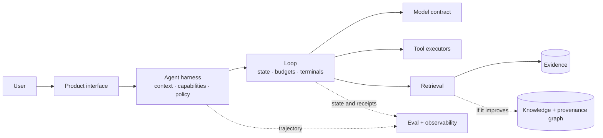

# Module 09 — Field project

The end of the path is not an exam or a mockup that works only during a demo. It is a bounded system
that solves real work, accumulates operational evidence, and lets someone reconstruct why it made
every important decision.

You do not need to include every technique in the course. You need to justify the ones you use,
measure them against a simpler alternative, and prove that the system fails under control.

## Module map

| Resource | What it resolves |
|---|---|
| [`01-propuestas-de-proyecto.md`](01-propuestas-de-proyecto.md) | Five scenarios and a filter for proposing your own |
| [`02-documento-de-arquitectura/`](02-documento-de-arquitectura/) | Living document and ADRs with real alternatives |
| [`03-guia-rag.md`](03-guia-rag.md) | External evidence, retrieval, and stage-level evaluation |
| [`04-guia-agente.md`](04-guia-agente.md) | Authority, tools, harness, loop, and failures |
| [`05-guia-despliegue.md`](05-guia-despliegue.md) | Deployment, SLOs, and measurement from a real user |
| [`06-guia-llmops.md`](06-guia-llmops.md) | Quality, cost, latency, and operational signals |
| [`07-analisis-de-costes.md`](07-analisis-de-costes.md) | Measured cost and scale scenarios |
| [`08-defensa-y-demo.md`](08-defensa-y-demo.md) | Product story, real failure, and technical review |
| [`checklist-final.md`](checklist-final.md) | Verifiable evidence for every gate |

## Evidence gates

The project is ready only when it passes every applicable gate:

1. **Real work:** a concrete user, decision, or task; not “a chatbot for X.”
2. **Model contract:** replaceable provider with observable limits and usage.
3. **Evidence:** external context with identity, validity, citations, or abstention.
4. **Harness:** capabilities, permissions, isolation, traces, and reproducible evals.
5. **Loop:** terminal states, budgets, cancellation, idempotency, and resumption.
6. **Graph decision:** measured improvement on relational queries or an ADR justifying no graph.
7. **Production:** SLOs, cost, security, alerts, and a tested runbook.
8. **Reproducibility:** a third party can run, break, and verify the system.

Certifications are optional and live in their own route. They do not count as evidence that this
system works.

## Reference architecture

Your solution may be simpler. This map shows boundaries, not mandatory products:

If an arrow does not exist in your case, explain why. If it does, it must have a contract, owner, and
failure signal.

## Delivery sequence

### 1. Frame

Define the JTBD, user, outcome, permitted data, highest-risk action, and budget. Write ADRs for the two
decisions most likely to change the product.

### 2. Cut a live vertical slice

Deploy the minimum path from input to outcome early. Enable traces and measurement before optimizing
quality; you cannot reconstruct data you never collected.

### 3. Establish baselines

Compare the simplest model, minimum retrieval, deterministic workflow, and no graph. Add complexity
only when a dataset segment demonstrates the need.

### 4. Break the system

Inject tool failure, conflicting sources, ambiguous timeout, prompt injection, cancellation, and
version change. Turn every relevant failure into a regression case.

### 5. Harden and operate

Set SLOs, budgets, alerts, and a runbook. Run representative load and a simulated incident. Measure
real cost per outcome, not only price per token.

### 6. Defend

Explain what you believed, what failed, which evidence changed the design, and what you would remove
with more time. Include a controlled failure in the demo; a perfectly happy recording does not prove
operability.

## Review signals

| Dimension | Strong evidence | Fragile-demo signal |
|---|---|---|
| Product | Defined use and outcome; feedback from a target person | Generic case without a real decision |
| Quality | Dataset, segments, baseline, and reviewed failures | One average chosen after testing |
| Authority | Capabilities and effects bounded by policy | The prompt asks the model to behave |
| Durability | Crash and resumption without duplication | Happy path held only in memory |
| Provenance | Claims linked to sources and versions | Decorative URLs at the end of text |
| Operations | SLOs, alerts, and runbook activated | Dashboard without an associated decision |
| Cost | Real receipt and driver-based projection | Token calculator without real traffic |
| Engineering | Reproducible installation and adversarial tests | Works only on the author's laptop |

No average lets a beautiful demo compensate for an authority violation. Security, provenance, and
reproducibility gates are binary.

## Deliverables

1. Executable repository with automated setup and a clear license.
2. Living architecture document and ADRs revised after measurement.
3. Evaluation dataset, baselines, and segmented results.
4. Harness, capability manifest, and authority policy.
5. Loop, state table, journal, checkpoints, and receipts.
6. Graph decision backed by ablation.
7. Deployment or reproducible package with observability.
8. Costs, SLOs, threat model, runbook, and postmortem.
9. Demo and review linking to the previous evidence.

## Field rules

- Close scope before optimizing; change the corpus if it cannot support the problem.
- Set budgets and metrics before seeing results.
- Deploy a minimum vertical slice before you need operational history.
- Do not confuse a fluent response with a correct outcome.
- Retain failures that changed the design: they are central to the portfolio.
- Use assistants to build, but do not present a decision you cannot explain and verify.

## Final criterion

Hand the project to someone who did not build it. They must be able to install it, run a happy and an
adversarial case, locate evidence for an answer, cancel a run, and understand the final state without
you cleaning anything manually. When that happens, it is no longer a demo.
